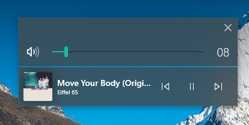

# THIS APP WILL BE INTEGRATED INTO DYNAMIC SHELL.
DShell will be open sourced soon.

# FOR AN UPDATED STANDALONE PROJECT: https://github.com/ShankarBUS/ModernFlyouts
# THIS PROJECT IS NOW READ ONLY.

# AudioFlyout
*Replace the Volume/SMTC UI with a custom one. Only for **Windows 10 17763+***

This repo is an example of how you **shouldn't** code. Code readibility is "wontfix".

## Demo running AudioFlyout:

# How to install
Follow this guide (I haven't made an installer... yet.): [Guide](guide.md)
