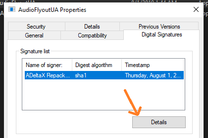
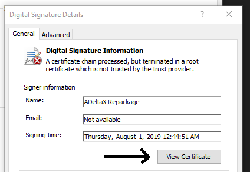
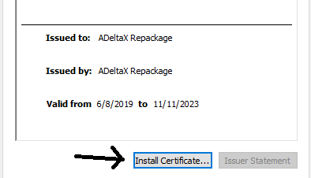
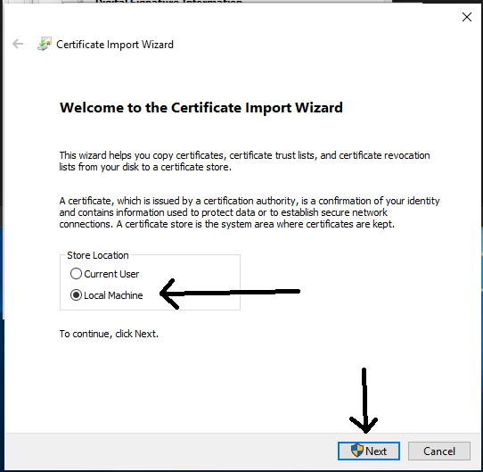
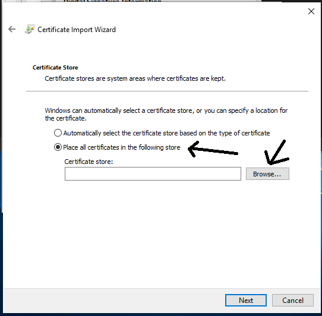
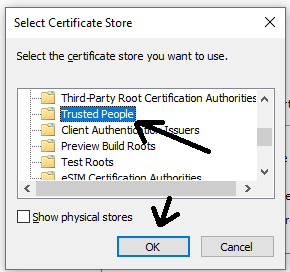
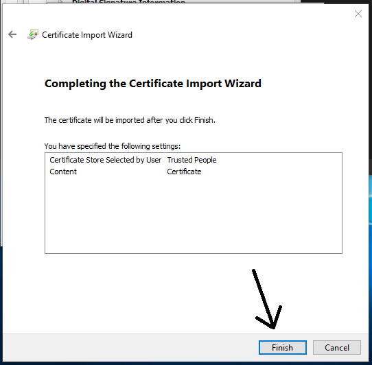

# There are 2 zip files in "releases"
- AudioFlyout.zip
- AudioFlyoutUA.zip

### What are the differences?
**AudioFlyout.zip** -> uses admin privilege to hook the volume up/down and media keys (next, previous, play/pause, stop) from any window.\
**Pro**: This can be run from any folder without any problem.\
**Cons**: this will not be the top most window (task manager in always on top will cover the AudioFlyout window), can't be displayed on lock screen.

**AudioFlyoutUA.zip** --> doesn't make use of admin privilege but it makes use of **UI Access**. This will give access to create a **top top most** window, displayable even in lock screen.\
**Cons**: this requires to be extracted in a protected folder (ex: Program Files), and it should be signed.\
**Cons**: **this is test signed, as a code signing certificate is expensive for me to obtain**, which means you need to trust the certificate to run it.

### What I should use?
If security and adding test certs to "Trusted people" isn't really an issue for you, I suggest to use AudioFlyoutUA.zip\
It's like adding test certificates to install an appx.

# How to install for "AudioFlyoutUA.zip"
Extract this on "Program Files (x86)" (or "Program Files" if you are running Windows 10 32-bit)\
> You should have something like "C:\Program Files (x86)\ADeltaX\AudioFlyout"

**Adding test certificate to "Local Machine\Trusted People"**:\
Right-click on AudioFlyoutUA.exe and go to "Digital Signatures" tab, then follow the images:
\
\
\
\
\
\
\

Once done, you can launch it using AudioFlyoutLauncher.exe (or create a shortcut to your desktop)\

# How to install for "AudioFlyout.zip"
Extract where you want, and launch AudioFlyout.exe\
Done!

# How to add AudioFlyout to "permanently" replace Volume HUD:
Well, actually you can't replace it, AudioFlyout just hides the Windows 10 Volume HUD (check how in AudioFlyout/Classes/VolumeSMTC.cs), but you can set it up to launch as you login\

TODO: finish this guide (HINT: Create a new task in Task Scheduler, Tick "Run with highest privileges", Action => run AudioFlyoutLauncher.exe, Trigger => At startup, Untick "Start the task only if the computer is on AC power" and "Stop the task if it runs longer than")
